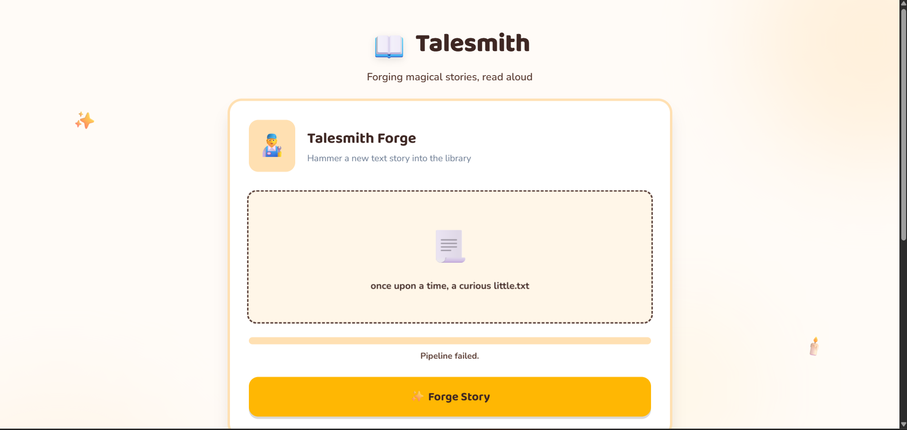

# 📖 Talesmith

A cloud-native **Talesmith** built using **HTML5**, **Python**, **AWS Lambda**, and **Amazon Polly**. The application generates engaging stories from user prompts and instantly converts the generated text into realistic speech using Amazon Polly's Text-to-Speech (TTS) service.

Designed with a serverless architecture, this project demonstrates AI-powered content generation, speech synthesis, and modern cloud-native application development using AWS services.

---

# 📸 Project Preview

<p align="center">
  
</p>

> **Note:** Place your dashboard screenshot inside the `assets` folder as `dashboard.png`.

---

# 🚀 Project Overview

The application allows users to enter a story prompt through a responsive web interface. The request is processed by an AWS Lambda function that generates a story and then uses **Amazon Polly** to convert the generated text into natural-sounding speech.

The generated story is displayed on the screen, while the synthesized audio can be played directly in the browser, creating an engaging storytelling experience.

---

# 🏗️ System Architecture

```text
                    User
                     │
                     ▼
        HTML / CSS / JavaScript Frontend
                     │
             HTTP API Request
                     │
                     ▼
             AWS Lambda Function
          (generate_story.py)
                     │
           Story Generation Logic
                     │
             Generated Story Text
                     │
                     ▼
               Amazon Polly
          (Text-to-Speech Engine)
                     │
          Generates MP3 Audio File
                     │
                     ▼
          Story + Audio Response
                     │
                     ▼
                Web Browser
```

---

# ✨ Features

## 📖 Story Generation

- Generate creative stories from user prompts
- Dynamic story generation
- Interactive storytelling experience

---

## 🔊 AI Voice Narration

- Converts generated stories into natural speech
- Powered by Amazon Polly
- Neural Text-to-Speech (TTS)
- Instant audio playback
- High-quality voice synthesis

---

## ☁️ Serverless Architecture

- AWS Lambda execution
- Event-driven processing
- Stateless backend
- Cloud-native architecture

---

## 🎨 User Interface

- Responsive dashboard
- Modern design
- Mobile-friendly layout
- Story preview
- Audio playback support

---

# 💻 Technology Stack

## Frontend

- HTML5
- CSS3
- JavaScript

## Backend

- Python 3
- AWS Lambda

## AWS Services

- AWS Lambda
- Amazon Polly
- Amazon API Gateway *(if used)*

## Cloud Concepts

- Serverless Computing
- Event-Driven Architecture
- REST API Integration

---

# 📂 Project Structure

```text
Story-Telling/

│
├── assets/
│   └── dashboard.png
│
├── lambda-functions/
│   └── generate_story.py
│
├── index.html
└── README.md
```

---

# ⚙️ Application Workflow

```text
User enters a story prompt
           │
           ▼
Frontend sends request
           │
           ▼
AWS Lambda
           │
           ▼
Generate Story
           │
           ▼
Amazon Polly
(Text-to-Speech)
           │
           ▼
Generate MP3 Audio
           │
           ▼
Return Story + Audio
           │
           ▼
Browser displays story
and plays narration
```

---

# 🔊 Amazon Polly Integration

Amazon Polly is the core service used in this project.

The generated story is sent to Amazon Polly, which converts the text into realistic human speech. The synthesized audio is then returned to the application, allowing users to listen to the generated story without requiring any additional software.

### Amazon Polly Features

- Text-to-Speech (TTS)
- Neural Voice Synthesis
- MP3 Audio Generation
- Real-Time Speech Conversion
- AWS Lambda Integration

---

# 🎯 Skills Demonstrated

- AWS Lambda
- Amazon Polly
- Python Programming
- Serverless Architecture
- Cloud Computing
- REST API Integration
- Event-Driven Development
- HTML5
- CSS3
- JavaScript
- Git & GitHub

---

# 🚀 Future Enhancements

- Multiple voice options
- Story categories
- Story history
- Download generated audio
- Multi-language narration
- Amazon Bedrock integration
- User authentication
- DynamoDB integration
- Speech translation
- Background music support

---

# 📚 Learning Outcomes

This project demonstrates practical experience with:

- Serverless Cloud Architecture
- AWS Lambda Functions
- Amazon Polly Text-to-Speech
- Python Backend Development
- Frontend Integration
- API Communication
- Event-Driven Computing
- Cloud Application Development

---

# 👨‍💻 Author

**Nikhil Fegade**

Computer Engineering Student

**Python | AWS | Serverless | Amazon Polly | Cloud Computing | AI Applications**
